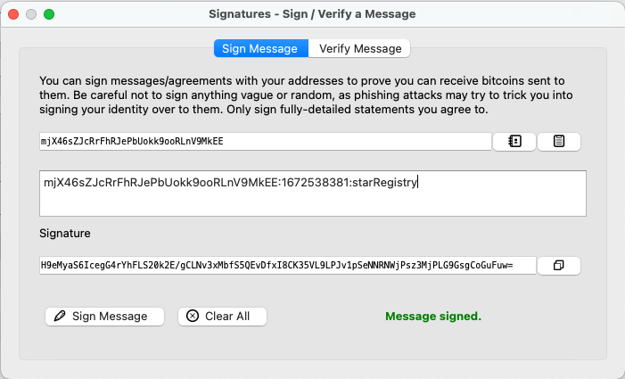

# Create Your Own Private Blockchain


## Description

This is a simple application that use private blockchain to register/record stars ownership. Blockchain codes are deployed in `src/block.js` and `src/blockchain.js`, while a set of API endpoints are created using `express.js`, API REST calls are used to add new stars on blockchain, validate added blocks, and query stars info. 

* The purpose of this project is to get familiarity with following concepts:
    - Block
    - Blockchain
    - Wallet
    - Blockchain Identity
    - Proof of Existence
    - Digital Assets


## Getting Started

- This application will be created using Node.js and Javascript programming language. 

### Dependencies

* Some of the libraries or npm modules you will use are:

    - "bitcoinjs-lib": "^4.0.3",
    - "bitcoinjs-message": "^2.0.0",
    - "body-parser": "^1.18.3",
    - "crypto-js": "^3.1.9-1",
    - "express": "^4.16.4",
    - "hex2ascii": "0.0.3",
    - "morgan": "^1.9.1"


### Installing

* Make sure that Node.js is installed on your system, for more info on how to install Node.js, please check: 

        https://nodejs.dev/en/learn/how-to-install-nodejs/

* Remember if you think you need install any other library you will use :
    
    `npm install <npm_module_name>`

### Executing program

1. To run application use the command: 
    
    ```node app.js```


* You should see in your terminal a message indicating that the server is listening in port 8000:
    
    ```> Server Listening for port: 8000```

### How to test your application functionalities?

* To test your application you need to install POSTMAN or Curl to send API requests, also you need Bitcoin-Core or Electrum wallet to sign messages.

#### Step 1: **getBlockByHeight API Call**
To make sure that application is working fine and it creates the Genesis Block you can use Curl to request the Genesis block **Block 0**:

Run following Curl command will will invoke getBlockByHeight method:

```curl
curl --location --request GET 'http://localhost:8000/block/height/0'
```

```json
Response Example:

{
"timeStamp":"1672538277",
"previousHash":"0x",
"body":"2247656e6573697320426c6f636b2122",
"hash":"98a5744a796df09a6f763ac92bc3e89357d9d294fbd5eb8ee0fe8fece4fdc1f4",
"height":0
}

```


#### Step 2: **requestOwnership API Call**
- This endpoint will allow you to request a message that you will use to sign it with your Bitcoin Wallet (Electrum or Bitcoin Core)
- This is the first step before submit your Block
- The endpoint will return a message to be signed in following format:

```<WALLET_ADDRESS>:${new Date().getTime().toString().slice(0,-3)}:starRegistry```

* To get ownership message run following curl command:

```
curl -X  POST 'http://localhost:8000/requestValidation' -H 'Content-Type: application/json' -d \
'{
    "address" : "mjX46sZJcRrFhRJePbUokk9ooRLnV9MkEE"
}'

```

```json
Response Example:

"mjX46sZJcRrFhRJePbUokk9ooRLnV9MkEE:1672538381:starRegistry"

```

#### Step 3: **Sign message ownership using Bitcoin-core Wallet**

Use Bitcoin-core or Electrum wallet to sign ownership message received in Step 2




#### Step 4: `Submit your star`

After you sign ownership message, you can use this endpoint to register new star data, once the message is submitted it can't be changed and a new star will be placed on a new Block, please make sure to submit you star within 5 minutes after requesting ownership message in Step 2.

The Start information will be formed in this format:

```json
     "star": {
         "dec": "68° 52' 56.9",
         "ra": "16h 29m 1.0s",
         "story": "Testing the story 4",
         "address": "mjX46sZJcRrFhRJePbUokk9ooRLnV9MkEE"
     }
```


To submit new start use following curl command"

```json

curl -X POST 'http://localhost:8000/submitstar' \
-H 'Content-Type: application/json' \
-d '{
    "address" : "mjX46sZJcRrFhRJePbUokk9ooRLnV9MkEE",
    "signature" : "H9eMyaS6IcegG4rYhFLS20k2E/gCLNv3xMbfS5QEvDfxI8CK35VL9LPJv1pSeNNRNWjPsz3MjPLG9GsgCoGuFuw=",
    "message" : "mjX46sZJcRrFhRJePbUokk9ooRLnV9MkEE:1672538381:starRegistry",
    "star" : {
        "dec" : "68 52 56.9",
        "ra" : "16h 29m 1.0s",
        "story" : "Testing submitStar 4"
    }
}'

```

```json
Response Example:

{
    "timeStamp":"1672541447",
    "previousHash":"98a5744a796df09a6f763ac92bc3e89357d9d294fbd5eb8ee0fe8fece4fdc1f4","body":"7b22646563223a2236382035322035362e39222c227261223a223136682032396d20312e3073222c2273746f7279223a2254657374696e67207375626d6974537461722034227d","hash":"82c74e19659cfbe0372757185c1b828c8a665380548aa508587f3b2d6d9d59e3",
    "height":1
    }

```


#### Step 4: StepRetrieve Stars owned by me

- This endpoint will return an array of Stars on the chain that belong to the owner with the wallet address passed in as parameter.
- This method will always return an array because a person can register more than one Star.

To retrieve all stars owned by specific wallet address use following curl command:

```curl
 curl -X GET 'http://localhost:8000/block/address/mjX46sZJcRrFhRJePbUokk9ooRLnV9MkEE'

 ```

```json
Response Example:

[{
    "timeStamp":"1672545832","previousHash":"456ce0d8ae9a4c28ffa207a5113579e605c677b8195697e78442e1631595df9c","body":"7b2273746172223a7b22646563223a2236382035322035362e39222c227261223a223136682032396d20312e3073222c2273746f7279223a2254657374696e67207375626d6974537461722034227d2c2261646472657373223a226d6a583436735a4a6352724668524a655062556f6b6b396f6f524c6e56394d6b4545227d","hash":"bc2815f2940db9c035e5c2ad4f458f632ac4dbfbae785b1575f1fa5f1bbcb767","height":1
}]

```


