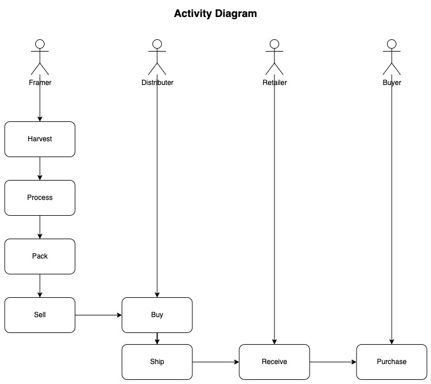
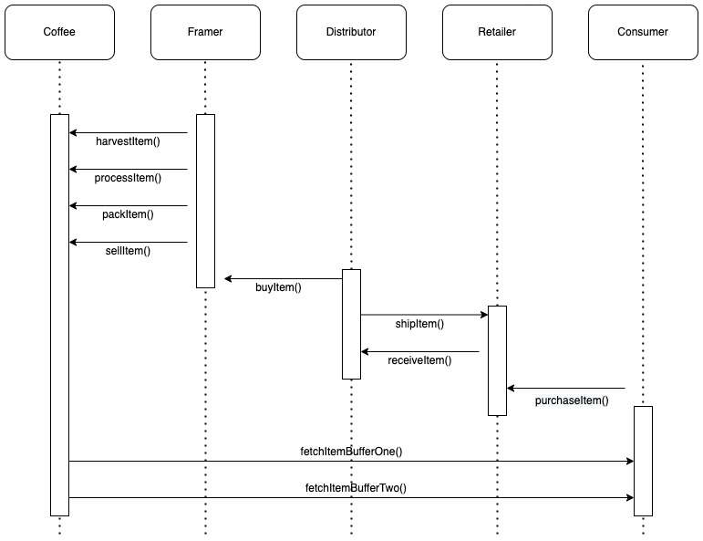
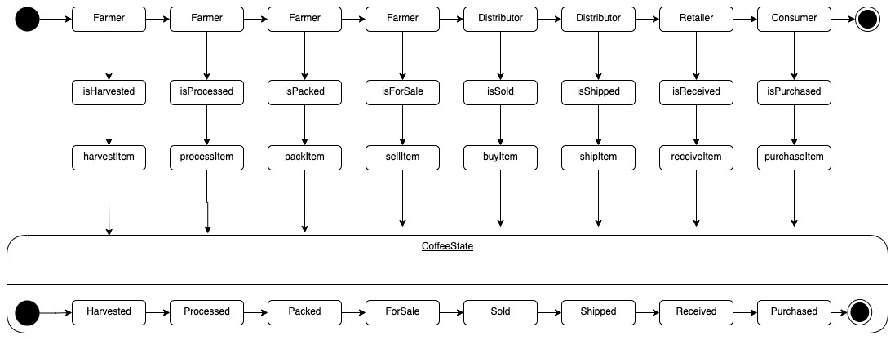
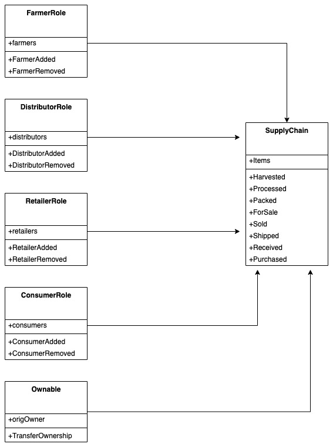

# Supply chain & data auditing


## Submission Information
- [x] [UML Diagrams](#UML-Diagrams)
- [x] [Libraries Write-up](#Libraries-Write-up)
- [x] [IPFS Write-up](#IPFS-Write-up)
- [x] [General Write-up](#General-Write-up)

## Summary
This repository containts an Ethereum DApp that demonstrates a Supply Chain flow between a Seller and Buyer. The user story is similar to any commonly used supply chain process. A Seller can add items to the inventory system stored in the blockchain. A Buyer can purchase such items from the inventory system. Additionally a Seller can mark an item as Shipped, and similarly a Buyer can mark an item as Received.


## Testing The dApp
```
%  truffle test                                           
Using network 'development'.

ganache-cli accounts used here...
Contract Owner: accounts[0]  0x27d8d15cbc94527cadf5ec14b69519ae23288b95
Farmer: accounts[1]  0x018c2dabef4904ecbd7118350a0c54dbeae3549a
Distributor: accounts[2]  0xce5144391b4ab80668965f2cc4f2cc102380ef0a
Retailer: accounts[3]  0x460c31107dd048e34971e57da2f99f659add4f02
Consumer: accounts[4]  0xd37b7b8c62be2fdde8daa9816483aebdbd356088


  Contract: SupplyChain
    ✓ Testing smart contract function harvestItem() that allows a farmer to harvest coffee (178ms)
    ✓ Testing smart contract function processItem() that allows a farmer to process coffee (100ms)
    ✓ Testing smart contract function packItem() that allows a farmer to pack coffee (66ms)
    ✓ Testing smart contract function sellItem() that allows a farmer to sell coffee (70ms)
    ✓ Testing smart contract function buyItem() that allows a distributor to buy coffee (138ms)
    ✓ Testing smart contract function shipItem() that allows a distributor to ship coffee (62ms)
    ✓ Testing smart contract function receiveItem() that allows a retailer to mark coffee received (135ms)
    ✓ Testing smart contract function purchaseItem() that allows a consumer to purchase coffee (135ms)
    ✓ Testing smart contract function fetchItemBufferOne() that allows anyone to fetch item details from blockchain
    ✓ Testing smart contract function fetchItemBufferTwo() that allows anyone to fetch item details from blockchain


  10 passing (977ms)
```
## Deploy dApp on Ropsten

SupplyChain contact address:   0xf0ad205c70db97ab9e5fd7a241bb8332b6355fa1
```
project-6 %  truffle migrate --network ropsten --reset --compile-all
Compiling ./contracts/Migrations.sol...
Compiling ./contracts/coffeeaccesscontrol/ConsumerRole.sol...
Compiling ./contracts/coffeeaccesscontrol/DistributorRole.sol...
Compiling ./contracts/coffeeaccesscontrol/FarmerRole.sol...
Compiling ./contracts/coffeeaccesscontrol/RetailerRole.sol...
Compiling ./contracts/coffeeaccesscontrol/Roles.sol...
Compiling ./contracts/coffeebase/SupplyChain.sol...
Compiling ./contracts/coffeecore/Ownable.sol...
Writing artifacts to ./build/contracts

Using network 'ropsten'.

Running migration: 2_deploy_contracts.js
  Deploying FarmerRole...
  ... 0xdfc0f624605fc5a89b95418c75f91cff250711eddd361eb313a4a38c8275f32c
  FarmerRole: 0xd628bc1c8d1e8c6a930efa19b44cfcd22506b7f5
  Deploying DistributorRole...
  ... 0x6aecb0b1d68670187fb4b88790745f06ce509e4fc0af7954957a0e3831b967b1
  DistributorRole: 0xb1e50a8ab10500328e2869311e87234d36ea3c0a
  Deploying RetailerRole...
  ... 0x14cbcf4285aa1583cebbe14146bebb57fd6e3afccf6f988b0e786caea4e27e30
  RetailerRole: 0x8731732f2dd8fd11a596fa38cdbd174c3b7c502d
  Deploying ConsumerRole...
  ... 0x8404a00ddb757208bbf0204db5c876e34a20218b92213345dfb5894ad04e6e76
  ConsumerRole: 0x73086f6dc395d2e98bb5978cd62235569d12fbdf
  Deploying SupplyChain...
  ... 0xf9fc6f49ff7eaebe43f22ec0336ab60d3e858c3f6bf1b350aaf8bc67cf22cd7d
  SupplyChain: 0xf0ad205c70db97ab9e5fd7a241bb8332b6355fa1
```

### UML Diagrams
I have created required UML diagrams

#### Activity Diagram


#### Sequence Diagram


#### State Diagram


#### Classes (Data Model)


### Libraries Write-up
Below are the dependencies in my `packages.json` file:
```json
"dependencies": {
    "@truffle/hdwallet-provider": "^2.0.4",
    "truffle-hdwallet-provider": "^1.0.17",
    "web3": "^1.7.1"
  }
}
```
### IPFS Write-up
I did not use IPFS.

### General Write-up
I built the dApp in five parts:

- **Part 1 - Plan the project:** I cretaed required UML diagrams.
- **Part 2 - Write smart contracts:** I completed unfinished smart contract functions based on provided tempalte, also added required test functions.
- **Part 3 - Test smart contract code coverage:** I used Truffle test to make sure that all test functions are passing.
- **Part 4 - Deploy smart contracts on Rinkeby:** I used Truffle to deploy SupplyChain contract on Ropsten Ethereum test network.
- **Part 5 - Build the frontend:** I confirmed that fronted html page is working as expected and disply transactions for each supply chain stage.
